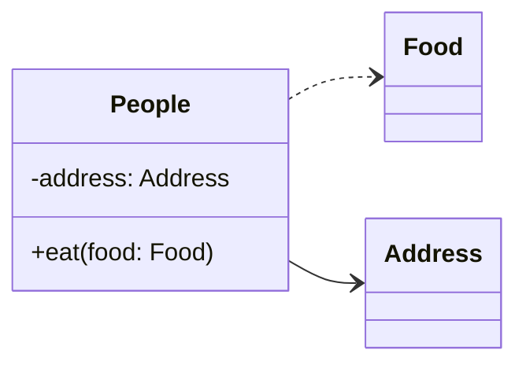

> **Note**:  
> This solution does work on local. But it doesn't work on production.

## What

I want to use [Mermaid](https://mermaid.js.org/) diagram on Markdown. By wrote this code (in code block) into `.md|mdx`:

```md
classDiagram 
  direction LR

  class People {
    - address: Address
    + eat(food: Food)
  }

  People ..> Food
  People --> Address
```

Astro should render this diagram as SVG for me



## How

From Astro document, we can create Markdown plugin with Remark[^1]. All we need to do is

1. Create plugin file in `./src/plugins/mermaid.ts`
2. Update Astro's config in `./astro.config.mjs`
3. Put Mermaid initial code in `./src/layouts/Layout.astro`

### Create Markdown plugin

Target: `./src/plugins/mermaid.ts`[^2]

```ts
import type { RemarkPlugin } from "@astrojs/markdown-remark";
import { visit } from "unist-util-visit";
import dedent from "ts-dedent";

const escapeMap: Record<string, string> = {
  "&": "&amp;",
  "<": "&lt;",
  ">": "&gt;",
  '"': "&quot;",
  "'": "&#39;",
};

const escapeHtml = (str: string) => str.replace(/[&<>"']/g, c => escapeMap[c]);

// @ts-ignore
export const mermaid: RemarkPlugin<[]> = () => tree => {
  visit(tree, "code", node => {
    if (node.lang !== "mermaid") return;

    // @ts-ignore
    node.type = "html";
    node.value = dedent`
      <div class="mermaid" data-content="${escapeHtml(node.value)}">
        <p>Loading graph...</p>
      </div>
    `;
  });
};
```

### Update Astro's config

Target: `./astro.config.mjs`

import the new plugin and put in `markdown.remarkPlugins`

```js
// ...
import { mermaid } from "./src/plugins";

export default defineConfig({
  markdown: {
    remarkPlugins: [
      mermaid,
      // ...
    ],
  }
})
```

### Put Mermaid initialize code into main layout file

Target: `./src/layouts/Layout.astro`

Put this code within `<body />`[^3]

```html
<script>
  const graphs = document.getElementsByClassName("mermaid")
  if (document.getElementsByClassName("mermaid").length > 0) {
    const { default: mermaid } = await import("mermaid")
    mermaid.initialize({
      startOnLoad: false,
      fontFamily: "var(--sans-font)",
      // @ts-ignore This works, but TS expects a enum for some reason
      theme: window.matchMedia("(prefers-color-scheme: dark)").matches ? "dark" : "default",
    })

    for (const graph of graphs) {
      const content = graph.getAttribute("data-content")
      if (!content) continue
      let svg = document.createElement("svg")
      const id = (svg.id = "mermaid-" + Math.round(Math.random() * 100000))
      graph.appendChild(svg)
      const result = await mermaid.render(id, content)
      graph.innerHTML = result.svg
    }
  }
</script>
```

## References

[^1]: [Astro docs / Markdown content / Markdown plugins](https://docs.astro.build/en/guides/markdown-content/#markdown-plugins)
[^2]: [Github.com/withastro/issue/4433 - Markdown mermaid is not supported](https://github.com/withastro/astro/issues/4433#issuecomment-1229355501)
[^3]: [Mermaid API usage](https://mermaid.js.org/config/usage.html#api-usage)
